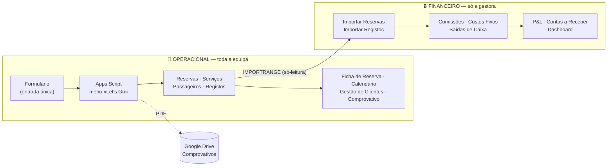
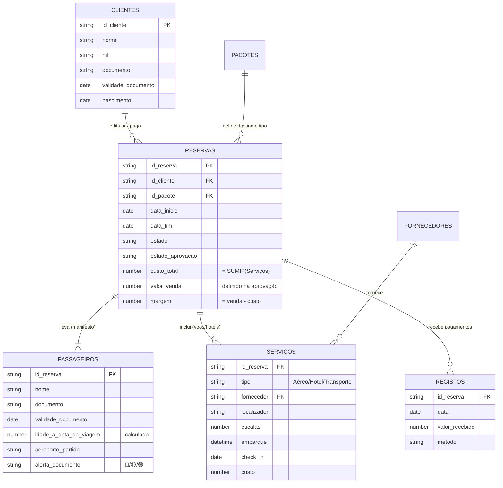

# Sistema de Gestão para Agência de Viagens

> Sistema de gestão completo — reservas, passageiros, fornecedores, pagamentos e financeiro —
> construído sobre Google Sheets + Apps Script para uma agência de viagens real.
> Dois ficheiros ligados, modelo de dados relacional, automação por menu e separação
> de confidencialidade entre equipa e gestão.


---

## O problema

Uma agência de viagens com dois atendentes geria tudo em folhas soltas, e-mails e memória.
Os sintomas eram os do costume:

- **Não se sabia quanto faltava receber.** Reservas a prestações sem histórico de pagamentos.
- **Erros no check-in.** Idade do passageiro calculada à mão, documentos a expirar antes da viagem.
- **Sem noção de lucro.** Faturação ≠ lucro, e ninguém cruzava o custo dos fornecedores com a venda.
- **Zero confidencialidade.** Comissões e margens no mesmo sítio onde os atendentes trabalhavam.
- **Preços definidos ao balcão.** Sem passo de aprovação entre o custo lançado e o valor cobrado.

O desafio real não era técnico — era **desenhar o processo** e só depois escolher a ferramenta.

## A solução

Um sistema de **dois ficheiros ligados**, cada um com o seu público:

| | 📗 **Operacional** | 🔒 **Financeiro** |
|---|---|---|
| **Quem acede** | Toda a equipa (edição) | Só a gestora |
| **Contém** | Clientes, reservas, serviços, passageiros, pagamentos recebidos | Comissões, margens, custos fixos, fluxo de caixa, P&L |
| **Abas** | 17 | 12 |
| **Ligação** | — | Lê o Operacional por `IMPORTRANGE` (só-leitura) |

A confidencialidade não é cosmética (não é "esconder colunas") — é **estrutural**: o ficheiro
Financeiro nunca é partilhado. Quem tem o link do Operacional não tem como lá chegar,
porque o `IMPORTRANGE` só funciona num sentido.

## Arquitetura



## Modelo de dados

A decisão de engenharia mais importante do projeto: passar de *"uma reserva = uma linha com
colunas fixas"* para um **modelo relacional**. Foi o que permitiu viagens multi-destino
(vários voos e hotéis) e grupos com dados de check-in por pessoa.



**Porquê separar `PASSAGEIROS` de `CLIENTES`:** numa família de 5, só uma pessoa paga.
Tratar os 5 como clientes inflacionaria o catálogo e distorceria todas as métricas
(nº de clientes, ticket médio, CRM). O cliente é quem contrata; o passageiro é quem viaja.

## Funcionalidades

<details>
<summary><b>Fluxo de aprovação de preço</b> — separa quem lança custos de quem define a venda</summary>

O atendente cria a reserva e lança os serviços. A reserva nasce em `Aguarda aprovação`, **sem
valor de venda**. A gestora vê o custo total e usa `✅ Aprovar reserva / definir venda` para
fixar o preço ao cliente. O Financeiro só contabiliza receita/custo de reservas aprovadas.
Se a venda for inferior ao custo, o script pede confirmação explícita.
</details>

<details>
<summary><b>Check-in à prova de erros</b> — idade à data da viagem e alerta de documento</summary>

Cada passageiro tem a idade calculada **na data da viagem** (não a de hoje) — o que interessa
para emitir passagens. E um alerta que cruza a validade do documento com a data de regresso:
🔴 expira antes do regresso · 🟡 validade curta (< X meses, parametrizável) · 🟢 OK.
</details>

<details>
<summary><b>Pagamentos a prestações sem código</b> — log append-only</summary>

Cada pagamento é uma linha em `Registos`. A reserva recalcula sozinha o pago, o pendente,
as prestações em falta e a % paga (`SUMIF`/`COUNTIF`). Há histórico, e o script recusa
pagamentos superiores ao valor pendente.
</details>

<details>
<summary><b>Dashboard executivo</b> — 16 KPIs + destaques</summary>

Faturação, margem, **lucro previsto vs. lucro de caixa**, a receber, comissões, custos fixos,
saldo de caixa, nº de clientes, ticket médio por cliente e por reserva, receita do último mês
e variação vs. mês anterior. Mais: pacote e destino mais vendidos.
O caixa é calculado a partir de recebimentos e **saídas reais**, não de valores faturados.
</details>

<details>
<summary><b>Auditoria e segurança operacional</b></summary>

- `LockService` — impede IDs duplicados quando dois atendentes gravam ao mesmo tempo.
- **Rollback** — se a reserva falhar a meio, apaga cliente/reserva/passageiro já criados.
- **Histórico** — ações do menu *e* edições manuais, com utilizador, célula, valor antes/depois.
- **Validações** — datas coerentes, prestações, custos ≥ 0, pagamento ≤ pendente.
</details>

<details>
<summary><b>Outras</b></summary>

Calendário mensal automático · CRM (canceladas com motivo, em orçamento, por aprovar) ·
Comprovativo em PDF gerado para pasta própria no Drive · Aba `Configurações` que parametriza
listas e regras sem tocar em fórmulas.
</details>

## Decisões de engenharia

| Decisão | Alternativa rejeitada | Porquê |
|---|---|---|
| **Google Sheets**, não Excel | Excel + OneDrive | Partilha por ficheiro (base da confidencialidade), `IMPORTRANGE`, Apps Script, e a equipa já usava. |
| **Dois ficheiros**, não um com abas ocultas | Ficheiro único | Ocultar colunas **não é segurança**. Permissões só existem ao nível do ficheiro. |
| **Modelo relacional** (Serviços/Passageiros) | Colunas fixas (Voo 1, Voo 2…) | Colunas fixas têm limite rígido e não aguentam roteiros multi-cidade. |
| **`INDEX`/`MATCH`**, não `XLOOKUP` | `XLOOKUP` | Compatibilidade com o pipeline de validação (LibreOffice) e versões antigas. |
| **Log append-only** para pagamentos | Editar um contador | Dá histórico, é auditável e evita perder informação. |
| **Aprovação explícita** da venda | Preço livre pelo atendente | Foi um requisito de negócio: o custo tem de subir à gestão antes de haver preço. |

## Stack

- **Google Sheets** — motor de cálculo e interface
- **Google Apps Script** (JavaScript) — automação, validações, PDF, auditoria
- **Python** (`openpyxl`) — geração programática dos livros `.xlsx` (17 + 12 abas, ~1.600 fórmulas)
- **LibreOffice headless** — pipeline de validação (recalcular e detetar `#REF!`/`#N/A` antes de entregar)

## Estrutura do repositório

```
.
├── planilhas/                   # os dois livros, prontos a importar
│   ├── Operacional_Agencia_Final.xlsx
│   └── Financeiro_Agencia_Final.xlsx
├── src/
│   ├── apps-script/
│   │   └── Lets_Go_script.gs    # automação (menu, validações, PDF, histórico)
│   └── build/                   # geradores Python dos livros
│       ├── brand.py             # sistema de design (paleta, fontes, helpers)
│       ├── sample_data.py       # dados de exemplo (fictícios)
│       ├── build_operacional.py
│       └── build_financeiro.py
├── docs/
│   ├── arquitetura.md
│   ├── modelo-de-dados.md
│   ├── decisoes.md              # registo de decisões (ADR)
│   ├── licoes-aprendidas.md     # armadilhas técnicas encontradas
│   └── guia-do-cliente.md       # manual do utilizador final
├── INSTALACAO.md
└── CHANGELOG.md                 # v1 → v2 → v3
```

## Instalação

Ver **[INSTALACAO.md](INSTALACAO.md)** — resumo: importar os `.xlsx` para o Google Sheets,
colar o script em `Extensões ▸ Apps Script`, ligar o `IMPORTRANGE` e partilhar **apenas**
o Operacional com a equipa.

## Lições aprendidas

As mais úteis estão em **[docs/licoes-aprendidas.md](docs/licoes-aprendidas.md)**. Três amostras:

1. **Nunca fazer round-trip `.xlsx` ↔ Google Sheets depois do sistema estar vivo.**
   Intervalos abertos (`A3:A`) são truncados para `A3:A3` ao gravar em `.xlsx`, e fórmulas
   `FILTER` que se expandem deixam lixo (`#ERR520`) nas células por baixo — o que depois
   bloqueia a expansão no Sheets. Encontrei 351 células assim numa versão e custou-me um
   diagnóstico completo. Depois de migrar, trabalha-se por cópia dentro do Drive.
2. **Locale importa.** Escrever fórmulas com `,` num Sheets em português (que usa `;`) parte tudo.
   Solução: colar **valores** e propagar as fórmulas já existentes com `Ctrl+D`.
3. **"Esconder" não é "proteger".** A separação de confidencialidade tem de ser arquitetural.

## Estado e próximos passos

- [x] v1 — dois ficheiros ligados, prestações, dashboard
- [x] v2 — modelo relacional (Serviços/Passageiros), aprovação, CRM, calendário
- [x] v3 — auditoria, `LockService`, rollback, P&L anual, caixa real
- [ ] Recibo e voucher em PDF (além do comprovativo)
- [ ] Previsão de fluxo de caixa por data de vencimento das prestações
- [ ] Regime de IVA de margem (a confirmar com contabilista)
- [ ] Arquivo anual (1 ficheiro/ano) quando o volume crescer

## Nota sobre os dados

**Todos os dados incluídos são fictícios** e gerados para demonstração. Nomes, documentos,
NIF, contactos e valores não correspondem a pessoas ou reservas reais. Nenhum dado de
clientes da agência consta deste repositório.

## Licença

MIT — ver [LICENSE](LICENSE).

---

<sub>Desenvolvido por <a href="https://github.com/ghagol">@ghagol</a> ·
<a href="https://linkedin.com/in/ghabmr">LinkedIn</a></sub>
